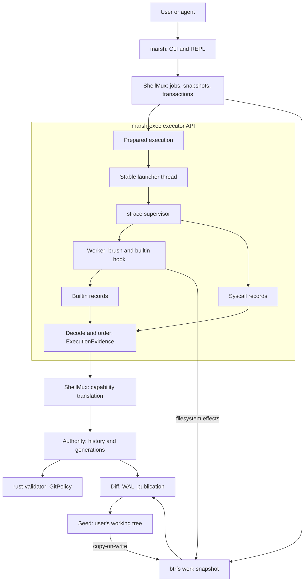
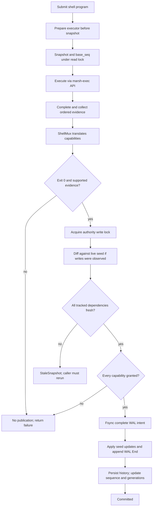

# marsh architecture overview

This is an onboarding map for an agent encountering marsh for the first time.
It describes the current implementation, not a proposed architecture.

## 1. The problem and the design choice

Several agents need to run commands against the same project without silently losing work.
An ordinary shell changes shared files immediately, exit status alone cannot describe its effects, and a command can also depend on files another agent changes before that command finishes.
marsh separates execution from publication: run privately, observe, decide, then publish. It is a Linux transactional shell built on retained brush shell libraries.
The user's working tree is a btrfs subvolume called the seed, not a checkout marsh exports later.
Each ordinary submitted command executes against a copy-on-write snapshot of that seed.
A successful command publishes only if its evidence is understood, fresh, and fully authorized.
Execution can overlap; publication and capability-history updates are serialized.
Rejected filesystem changes stay out of the seed; the caller receives a reason to act on.
This coordinates cooperating principals; it is not a security sandbox or an AI-agent launcher.

## 2. Vocabulary

- **Session:** one seed, its adjacent persistent state, the `MarshExecutor` holding its lease, and the `ShellMux` built on that executor.
- **Seed:** the user's actual btrfs working tree and the destination of accepted changes.
- **Job / sandbox:** a named principal, identified by a `ShellId`, with a seed-relative working directory and runtime state.
- **Principal:** the job name used by policy, not a Linux account or an authentication identity.
- **Snapshot:** the private filesystem view in which an executor runs a command.
- **Transaction:** one command's execution, collected evidence, decision, and optional publication.
- **Resource:** an ordered, seed-relative path such as `src/lib.rs`; display uses `/` separators.
- **Event:** a `(principal, action, resource)` capability request reconstructed after execution.
- **Authority:** shared committed event history, path generations, and the commit sequence.
- **Stale:** a command depended on a tracked path changed after its snapshot was taken.
- **Commit:** marsh publication into the seed; not necessarily a Git commit object.
- **WAL:** write-ahead log recording durable publication intent before seed mutation.

## 3. System diagram: components and data

These boxes are responsibilities, not separate services; the authority is embedded in marsh.
The executor box is a library/API boundary that spans processes rather than a service: its launcher thread runs inside `marsh`, while `strace` supervises the separate `marsh-exec` worker.
Both instrumentation streams are internal to that boundary and are decoded and ordered inside it.
`ShellMux` receives one combined evidence object; it never opens or interleaves the two logs.

## 4. Crate boundaries

- `marsh-shell` builds `marsh` and owns CLI entry, command routing, the REPL, and terminal UI.
- `shellmux` owns jobs, terminals, snapshots, authorization, publication, and recovery.
- `marsh-exec` owns the executor library, the persistence layer whose lease that executor holds, and the `marsh-exec` worker binary it launches under `strace`.
- `rust-validator` is the directory; its Cargo package is `junco-rust-validator`.
- Its Rust library name is `rust_validator`; it evaluates history-dependent capability policy.
- `brush-parser` tokenizes and parses POSIX/Bash-style shell syntax into an AST.
- `brush-core` implements interpretation, expansion, redirections, processes, and shell state.
- `brush-builtins` supplies ordinary shell builtins; marsh adds its own Git and session commands.
- `brush-interactive` provides frontend facilities used by the interactive shell.
The main dependency direction is frontend to mux to executor and validator, with retained brush support.
Policy does not launch processes or apply filesystem changes; those remain mux responsibilities, and the executor implements shell semantics without granting publication into the seed.

## 5. Session discovery and storage

`PersistenceLayer::discover(start)` canonicalizes the launch directory and finds its nearest subvolume ancestor; the seed must not be the root of its own mount, because marsh needs writable state beside it.
State lives at `<seed>/../.marsh/<seed-name>/`, on the same btrfs filesystem.
The state directory's mount must allow `user_subvol_rm_allowed` for unprivileged reclamation.
`snap/<uid>` holds a job's transactional snapshot; `snap/read-<seq>` holds shared reader views.
`meta/runs/<uid>/trace.log` and `builtins.json` retain command instrumentation.
`meta/wal.jsonl` records publication intent; `meta/history.jsonl` preserves capability history.
`meta/purity.jsonl` records learned read-only classifications; `console.history` stores input history.
`meta/session.lock` is taken exclusively and nonblockingly by `MarshExecutorBuilder::build` and held for the executor's lifetime.
A second live session therefore fails at executor construction, before it can read, recover, reconcile, or reclaim the first one's state.
The default job starts at the launch directory expressed relative to the seed.
A seed can contain no Git repository, one, or several nested at different paths; marsh does not initialize repositories or import the project into a separate managed checkout.
Use `PersistenceLayer` accessors rather than reconstructing state-directory names in other modules; `run_dir(run_id)` is the one that validates, accepting exactly one plain path component.

## 6. What a submitted line means

The interactive shell sends each line through the small `repl::parse` router before brush evaluation.
Standalone `sd`, `fg`, `bg`, `jobs`, `stop`, `kill`, and `exit` forms control the session; they are not filesystem transactions, and registered builtins receive constructed argv, not reparsed text.
Other input is passed as shell-program text to the executor, preserving quoting and compound syntax.
A pipeline or compound program is one transaction governed by that program's final exit status.
Trailing `&` or `&NAME` requests a new background job without changing the current job.
Job creation reserves identity and directory first; actual launch takes the snapshot afterward.
Each transaction gets a fresh executor shell, not a persistent child interpreter for that job.
Variables, functions, and `cd` inside one transaction do not update the next transaction's shell state.

## 7. System diagram: one transactional command

This shows the full transaction path; learned read-only reuse takes a separate path below.

## 8. Executor and terminal boundaries

`ShellMux::run_cmd` performs the full lifecycle and captures stdout/stderr for library or batch callers.
A job instead runs on its own pseudoterminal and the mux owns both halves of its lifetime: a single `SIGCHLD` watcher task reaps every job's child, because only one waiter can distinguish a stop from an exit, and a single conclusion task performs the merge, because only one conclusion may merge.
A front-end observes the result through `ShellMux::wait_for_job` and never holds an open transaction.
`MarshExecutor::prepare` resolves the worker binary before any snapshot is replaced or leased, so a missing worker leaves the previous tree alone.
A lifetime-stable launcher thread inside the executor spawns tracers so transient launch-thread exit does not kill them.
`strace` follows the worker and its descendants, recording file/process syscalls and descriptor paths.
It runs `marsh-exec --hook-log <path> -c <program>` in the snapshot's job directory.
Separate execution is essential: shell redirections and builtins must be traceable too.
The worker dumps structured builtin records at exit; a failed dump makes execution fail.
The `exec` builtin is removed because replacing the worker would bypass that final record dump.
File descriptor 3 carries extra instrumentation, separate from stdout/stderr and the hook-log file; each job owns its own fd-3 pipe, which `ShellMux::read_instrumentation` drains.
`CompletedExecution::collect` reads both logs, so the mux releases any reader lease before that step.
The console forwards bytes between the real terminal in raw mode and the job's pseudoterminal rather than handing the terminal to a child; only `run_cmd` enforces the executor's command timeout, which defaults to `MarshExecutor::DEFAULT_CMD_TIMEOUT` and is overridden on the executor builder.

## 9. Turning execution into evidence

`RecordingHook` records builtin begin/end edges with argv, working directory, thread, and invocation ID.
The trace and hook records use the same realtime microsecond clock, and `ExecutionEvidence::parse` interleaves them; equal timestamps order begin, syscall, then end.
That tie-break keeps a Git builtin's boundary syscalls inside its recorded execution span.
The same decode extracts the traced root thread's exit status, which is the execution's own exit code.
`translate::translate` then reads that one ordered sequence; per-thread state tracks working directories and attribution across fork/clone operations.
Successful file opens and mutations become `Read` or `Edit` events for ordinary shell execution.
Write-intent opens count as edits even if the final bytes do not change.
Non-Git builtins need no separate capabilities: their observed filesystem operations describe them.
Successful Git builtin records instead produce a `GitAction`, which `translate` maps to the policy's action vocabulary in the single exhaustive conversion that exists.
A Git builtin's reads become extra freshness dependencies, including index, HEAD, and ref paths.
Its internal writes trigger physical diffing rather than separate policy requests for `.git` files.
Exact duplicate events are collapsed while retaining the first occurrence and distinct actions.
Paths outside the work root and paths under any `.git/` do not become ordinary resources.
`.git` paths still participate in physical publication and generation-based conflict detection.
Detected raw Git execution or inconsistent Git spans mark the command unsupported.
Evidence says what was requested; the filesystem diff says what would actually be published.

## 10. Why Git is implemented as builtins

A syscall trace cannot reliably distinguish staging from arbitrary writes to `.git/index`.
`gitshell` therefore registers supported two-token Git commands before generic executable lookup.
`gitexec` implements them synchronously through libgit2, inside the hook's begin/end span.
A single `gitcmd` grammar in `marsh-exec` serves execution and translation so their meanings cannot drift.
Supported forms name explicit paths: implicit whole-worktree targets and literal patterns are refused.
Examples include `git add -- p`, `git restore --staged -- p`, and `git checkout HEAD -- p`.
The action vocabulary also covers commit, stash, delete, clean, diff, and history.
A catch-all `git` builtin refuses unsupported forms such as `git status`; it does not fall through.
Launching a raw Git binary through another shell or an absolute path is not a supported escape.
Repository discovery stops at the snapshot root; separate nested repositories retain distinct paths.
Profile/rc loading and host Git configuration are suppressed to reduce hidden inputs.
A marsh commit can publish ordinary files without Git; a Git commit is just one supported action.

## 11. Capability policy and ownership

The validator evaluates relationships between the candidate event and ordered prior events.
Its rules use past regular expressions: patterns over execution history, not file-content regexes.
A rule matches a candidate's components and requires or forbids a pattern in the history prefix.
Canonical, arena-backed expressions share structure; evaluator caches avoid repeated derivation work.
The shipped `GitPolicy` interprets history as clean, staged, self-unstaged, or other-unstaged state.
For example, an edit by Alice leaves a resource Alice-owned and unstaged in the policy history.
Bob may read it, but cannot edit or stage Alice's unstaged resource merely because his command exits 0.
Read claims are separate: some mutations require the actor to be the resource's most recent reader.
Thus a read-only filesystem command can still change later authorization decisions.
`authority::check_events` checks the command's events in order against one shared history.
Granted prefixes are visible immediately to later events of that same command, which lets `printf x > p; git add -- p` stage the edit it just made.
All denied events are collected with failed preconditions and suggested state-changing fixes.
Any denial discards the tentative granted prefix: there is no partially authorized publication.

## 12. Concurrency and freshness

The authority's read lock makes snapshot creation and `base_seq` capture one consistent operation; execution holds no authority lock, so independent jobs can run concurrently.
The write lock covers diffing, freshness checks, policy decisions, and durable publication.
`generations[path]` records the sequence of the last marsh transaction to write that path.
`stale_paths` checks diff destinations, event resources, and the Git read set against `base_seq`.
Any relevant generation newer than the snapshot causes `StaleSnapshot`, not an automatic merge.
Policy rejection and staleness are independent: permission cannot make an outdated result current.
The physical diff compares with the live seed, not with a retained immutable base tree.
Another writer can therefore appear in the diff even when the two commands changed different files.
Conflicts are conservative; do not promise automatic merging of disjoint concurrent edits.
A caller must rerun stale work against the updated seed; marsh does not retry it transparently.
No-event, no-diff commands need no durable transaction entry and need not advance the sequence.
The sequence is not a count of every executed command, and history ordering also uses log order.

## 13. Publishing accepted changes

`diff_trees` produces ordered `Write` and `Remove` operations, including changes under `.git/`.
Unchanged snapshot inode metadata avoids needless content reads; changed files fall back to comparison.
Removals run deepest-first; writes run shallowest-first so parent/child replacement is deterministic.
`commit::apply` persists `Begin`, the expected operation count, and every operation before applying any, and each write records a content hash so recovery can recognize already-applied content.
`wal::apply_write` copies to a temporary beside the destination, syncs, renames, and syncs the parent.
Copying is necessary because renaming directly from snapshot to seed crosses subvolume boundaries.
After all operations, the WAL receives `End`; durable capability history is appended afterward.
Only then does the mux advance its in-memory sequence and changed-path generations.
The write lock prevents another marsh snapshot from seeing a half-applied publication.
It does not make the whole seed switch atomically for unrelated processes reading it directly.
An I/O failure during publication needs recovery; do not describe every `MuxError` as a rollback.

## 14. Restart and crash recovery

`MarshExecutorBuilder::build` takes the exclusive session lease first; `ShellMux::new` then materializes state and terminates positively identified leftover processes before touching their work trees.
WAL recovery runs before snapshot reclamation because unfinished writes may need snapshot content.
A complete durable intent is replayed idempotently even when its final `End` was never recorded.
An incomplete counted intent is abandoned; corrupt or inconsistent durable frames fail closed.
An already-applied destination can satisfy recovery when its hash matches the recorded content.
Recovery also recreates history entries missing after a crash between seed publication and history.
Only afterward does startup sweep old snapshots and WAL temporaries, then load history.
Reconciliation checks each resource's last mutation against repository dirt; inspection errors keep claims.
Read claims do not survive restart; durable audit history is not blindly reused as live ownership.
Startup restores the purity checker last, under the lease the already-built executor holds; old running jobs are not resumed.

## 15. Learned read-only execution

Per-command snapshots and two-tree diffing are expensive for repeated readers; purity avoids that work.
One `PurityChecker` serves a mux in one of two modes: a static proof from the command's own syntax, or a verdict learned from traced runs, which is the mode `marsh` selects.
`CommandKey` is the verbatim command text plus job directory; it is not an executable-content hash.
A successful, supported run with only `Read` events and no observed in-root writes can be learned pure.
`Plan::Bypass` reuses `snap/read-<seq>`, creating a shared snapshot for that version when needed.
Readers use a stable snapshot, never the live seed while a multi-file publication might be in progress.
The bypass still traces execution and records granted reads in capability history.
It performs no diff, WAL transaction, generation update, or new sequence allocation.
It does not rerun transactional freshness validation when that reader's seed version is superseded.
Writes, non-Read actions, or unsupported evidence produce `Escaped` and withdraw the purity verdict.
No bypass change is published; the dirtied reader tree is discarded when it can be reclaimed.
Reader trees are writable: a mistaken verdict can contaminate another concurrent reader of that tree.
Treat purity as a measured optimization with detection afterward, not proof of confinement.

## 16. Jobs, terminal control, and completion

A job accepts one command at a time; `sd NAME DIR` and `bg DIR` create and select jobs.
`CMD &NAME` creates a new named job; bare `&` creates an automatic job that normally closes afterward.
`fg` selects a job and attaches to whatever command it is running.
Attaching with `fg` keeps an automatic job; it cannot reopen a job explicitly marked for closure.
`jobs` distinguishes starting, running, merging, idle, and closing work.
Finalization runs on the mux's own conclusion task, never on a caller's future; a new command waits for that job's preceding merge to finish.
`stop NAME` refuses more work and closes after existing work; `stop -f NAME` kills and aborts it.
The main job cannot be stopped; `kill` targets process IDs rather than job names.
Forced closure preserves storage until owned processes are confirmed gone; it must never publish.
Ctrl-Z is disabled: a suspended job would hold a transaction nothing can conclude.

## 17. A concrete transaction walkthrough

Assume a fresh session at the seed root and no existing `report.txt`.
`sd alice .` selects Alice's job; `printf alice > report.txt` is one transaction.
The trace requests `(alice, Edit, report.txt)`; the snapshot contains the new bytes.
After full grant and publication, the seed has those bytes and Alice owns the unstaged resource.
Bob now writes `report.txt` from a fresh snapshot; his shell can exit successfully.
Freshness passes, but ownership policy returns `DeniedCaps`; Alice's seed content remains.
If Bob started before Alice's commit, `StaleSnapshot` can reject him before policy runs.
Rerunning fixes an outdated view; it does not grant permission to overwrite someone else's work.

## 18. Limits and result interpretation

Interpret `CmdOutcome`, not just process exit: exit 0 does not mean publication.
`Committed` and `Bypassed` are successful transaction/read outcomes, respectively.
`ExecFailed`, `Unsupported`, `DeniedCaps`, `StaleSnapshot`, and `Escaped` publish nothing.
These are expected outcomes inside `Ok(...)`; `MuxError` reports infrastructure failures.
Out-of-root writes, network requests, and other external side effects are not rolled back.
An absolute path to the live seed bypasses isolation; the session lock is not confinement.
`getdents64` is not traced, so directory-listing dependencies are outside freshness coverage.
Empty directories are not carried by the diff; creating only an empty directory does not publish it.
Do not infer full Bash/Git compatibility or complete metadata preservation from the retained libraries.

## 19. Where a new agent should start

Read the [README](../README.md), then [Sessions](session.md) and [Jobs](jobs.md) for deeper rationale.
Follow input through [entry.rs](../marsh-shell/src/entry.rs) and [repl.rs](../marsh-shell/src/repl.rs).
Follow transactions through [mux.rs](../shellmux/src/mux.rs) and [jobs.rs](../shellmux/src/jobs.rs).
Follow storage and execution through [persistence.rs](../marsh-exec/src/persistence.rs), [executor.rs](../marsh-exec/src/executor.rs), [strace.rs](../marsh-exec/src/strace.rs), and [main.rs](../marsh-exec/src/main.rs).
Follow evidence through [evidence.rs](../marsh-exec/src/evidence.rs), [translate.rs](../shellmux/src/translate.rs), and the shared `gitcmd` grammar.
Follow decisions through [authority.rs](../shellmux/src/authority.rs) and `rust-validator/src/policy/git/`.
Follow durability through [commit.rs](../shellmux/src/commit.rs), `wal.rs`, `history.rs`, and `reconcile.rs`.
Use `shellmux/tests/` for sequential, concurrent, job, recovery, exit, and purity regression contracts, and `marsh-exec/tests/` for the executor API's own behaviour.
Build both binaries: `cargo build -p marsh-shell -p marsh-exec`; keep them side by side.
Use Rust 1.94+ on Linux, with native btrfs/libclang libraries, Git, and `strace` 6.6 or newer.
Run relevant Rust tests; btrfs scratch belongs at Cargo's `target/tmp` per the [CI recipe](../.github/workflows/ci.yaml).
